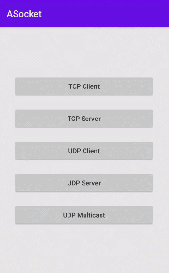

# ASocket

[](https://raw.githubusercontent.com/jenly1314/ASocket/master/app/release/app-release.apk)
[](https://repo1.maven.org/maven2/com/github/jenly1314/asocket)
[](https://jitpack.io/#jenly1314/ASocket)
[](https://travis-ci.com/jenly1314/ASocket)
[](https://circleci.com/gh/jenly1314/ASocket)
[](https://android-arsenal.com/api?level=16)
[](https://opensource.org/licenses/mit-license.php)
[](https://jenly1314.github.io/)
[](http://shang.qq.com/wpa/qunwpa?idkey=8fcc6a2f88552ea44b1411582c94fd124f7bb3ec227e2a400dbbfaad3dc2f5ad)

ASocket 是一个TCP/UDP协议的封装库，方便快速实现TCP的长连接与UDP的单播、组播、广播等相关通信。

> 通过 ASocket 统一管理 TCP/UDP 相关 Socket，让其适用于Android，在UI主线程调用和回调，在子线程异步处理消息的发送与接收

## Gif 展示


> 你也可以直接下载 [演示App](https://raw.githubusercontent.com/jenly1314/ASocket/master/app/release/app-release.apk) 体验效果

## 引入

### Gradle:

1. 在Project的 **build.gradle** 或 **setting.gradle** 中添加远程仓库

    ```gradle
    repositories {
        //...
        mavenCentral()
    }
    ```

2. 在Module的 **build.gradle** 里面添加引入依赖项
    ```gradle
    implementation 'com.github.jenly1314:asocket:1.0.0'
    
    ```


## 示例

### 主要用法示例
```kotlin
    //初始化一个ISocket的实现类（如：TCPClient、TCPServer、UDPClient、UDPServer、UDPMulticast）
    val tcpClient = TCPClient(host,port)
    //初始化ASocket
    val aSocket = ASocket(tcpClient)
    //设置状态监听
    aSocket.setOnSocketStateListener(object : ISocket.OnSocketStateListener{
        override fun onStarted() {

        }
    
        override fun onClosed() {
    
        }
    
        override fun onException(e: Exception) {

        }
    
    })
    //设置接收消息监听
    aSocket.setOnMessageReceivedListener { data ->
        //TODO 接收消息
    }
    //启动
    aSocket.start()


    //....
    //发送消息
    aSocket.write(data)

```

### 完整示例

#### TCPClient
[TCPClientActivity](app/src/main/java/com/king/asocket/app/tcp/TCPClientActivity.kt)

#### TCPServer
[TCPServerActivity](app/src/main/java/com/king/asocket/app/tcp/TCPServerActivity.kt)

#### UDPClient
[UDPClientActivity](app/src/main/java/com/king/asocket/app/udp/UDPClientActivity.kt)

#### UDPServer
[UDPServerActivity](app/src/main/java/com/king/asocket/app/udp/UDPServerActivity.kt)

#### UDPMulticast
[UDPMulticastActivity](app/src/main/java/com/king/asocket/app/udp/UDPMulticastActivity.kt)


## 特别说明

#### 组播IP地址特别说明
>  多播的地址是特定的，D类地址用于多播。D类IP地址就是多播IP地址，即224.0.0.0至239.255.255.255之间的IP地址，并被划分为局部连接多播地址、预留多播地址和管理权限多播地址3类：
>  局部多播地址：在224.0.0.0～224.0.0.255之间，这是为路由协议和其他用途保留的地址，路由器并不转发属于此范围的IP包。
>  预留多播地址：在224.0.1.0～238.255.255.255之间，可用于全球范围（如Internet）或网络协议。
>  管理权限多播地址：在239.0.0.0～239.255.255.255之间，可供组织内部使用，类似于私有IP地址，不能用于Internet，可限制多播范围。


更多使用详情，请查看[Demo](app)中的源码使用示例或直接查看[API帮助文档](https://jitpack.io/com/github/jenly1314/ASocket/latest/javadoc/)


### 相关推荐

#### [ANetty](https://github.com/jenly1314/ANetty) 基于Netty封装的Android链路通讯库，用以快速开发高性能，高可靠性的网络交互。在保证易于开发的同时还保证其应用的性能，稳定性和伸缩性。
#### [AWebSocket](https://github.com/jenly1314/AWebSocket) 基于okhttp封装的 WebSocket，简洁易用。

## 版本记录

#### v1.0.0：2021-10-13
*  ASocket初始版本

## 赞赏
如果你喜欢ASocket，或感觉ASocket帮助到了你，可以点右上角“Star”支持一下，你的支持就是我的动力，谢谢 :smiley:<p>
你也可以扫描下面的二维码，请作者喝杯咖啡 :coffee:
<div>

</div>

## 关于我

Name: <a title="关于作者" href="https://jenly1314.github.io" target="_blank">Jenly</a>

Email: <a title="欢迎邮件与我交流" href="mailto:jenly1314@gmail.com" target="_blank">
jenly1314#gmail.com</a> / <a title="给我发邮件" href="mailto:jenly1314@vip.qq.com" target="_blank">
jenly1314#vip.qq.com</a>

CSDN: <a title="CSDN博客" href="http://blog.csdn.net/jenly121" target="_blank">jenly121</a>

CNBlogs: <a title="博客园" href="https://www.cnblogs.com/jenly" target="_blank">jenly</a>

GitHub: <a title="GitHub开源项目" href="https://github.com/jenly1314" target="_blank">jenly1314</a>

Gitee: <a title="Gitee开源项目" href="https://gitee.com/jenly1314" target="_blank">jenly1314</a>

加入QQ群: <a title="点击加入QQ群" href="http://shang.qq.com/wpa/qunwpa?idkey=8fcc6a2f88552ea44b1411582c94fd124f7bb3ec227e2a400dbbfaad3dc2f5ad" target="_blank">
20867961</a>
   <div>
       
       
   </div>


   
